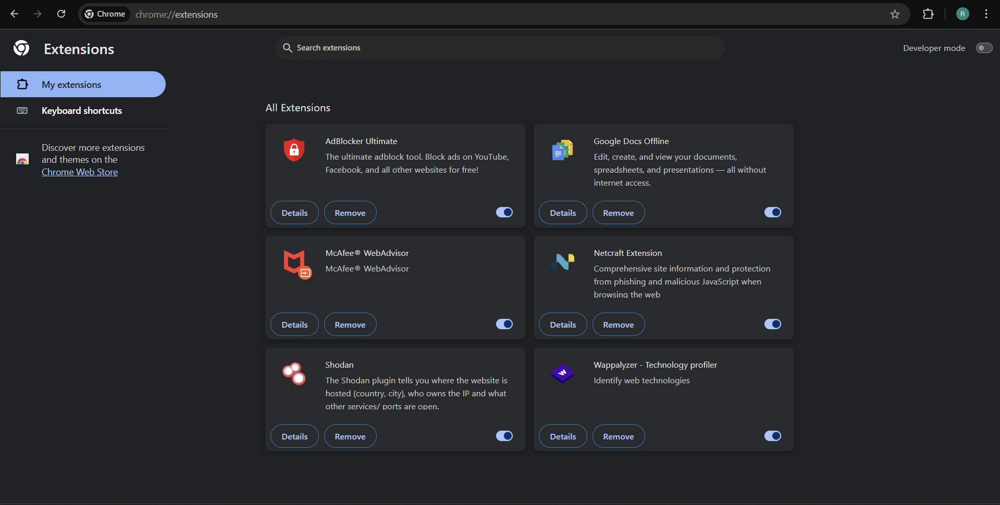
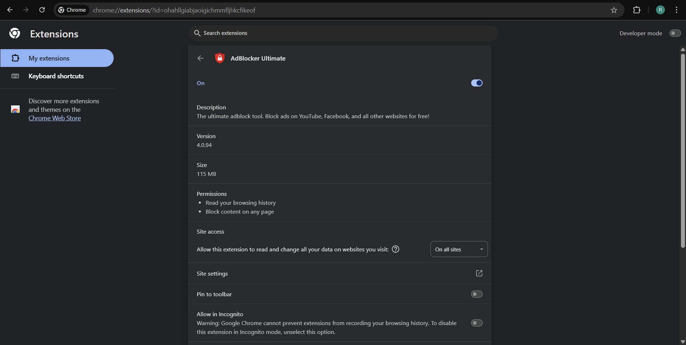

# 🔍 Browser Extension Security Report

**Objective:** Identify and remove suspicious or unnecessary browser extensions to enhance privacy and security.

---

## 🚀 Task Overview

- **Goal:** Spot and remove potentially harmful browser extensions.
- **Tools Used:** Chrome

---
## Installed extensions

## Reviewing Permission of Browser extensions

## 📝 Steps Taken

1. **Go to Extensions**  
2. **Click on manage Extensions**  
3. **List of installed extensions will appear.**  
4. **Click on Details of every extension.**  
5. **A detailed overview of a particular extension will appear** 
6. **You can check the permissions section for the given permissions**  
7. **If you find the extension suspecious or if it takes unnecessary permissions, you can remove it or uninstall it.**  
8. **Then you can start your browser again for better experience**  
9. **Document Findings**  
   Recorded all steps, findings, and recommendations in this report.

---

## 🧩 Extensions Reviewed

| Extension Name                  | Functionality                        | Permissions                       | Safety Assessment        | Action Taken     |
|---------------------------------|--------------------------------------|-----------------------------------|-------------------------|------------------|
| **AdBlocker Ultimate** | Blocks ads and unnecessary content              | Read browsing history, block content | Trusted, review privacy | Kept             |
| **Google Docs offline**    | Edit, Create and view documents                      | No special permissions            | Safe                    | Kept             |
| **McAfee WebAdvisor**      | Monitors websites  |Reads history, block content, manage downloads| Safe      | Kept             |
| **Netcraft**        |Site info, phishing & malicious javascript protection                | Read browsing history            | Safe                    | Kept             |
| **Shodan**      |Website details | Read browsing history | Safe         | Kept             |
| **Wappalyzer**| Identify Web technologies | Read Browsing history            | Safe                    | Kept             |

---

## ⚠️ Most Commonly Used Extensions Considered Unsafe

Even popular browser extensions can be unsafe due to privacy violations, malware, or malicious updates. Here are some widely used extensions that have been flagged as risky:

| Extension Name                      | Risk/Behavior                                                                 | 
|--------------------------------------|------------------------------------------------------------------------------|
| **Autoskip for YouTube**             | Injects adware links, tracks user actions; 9+ million downloads              |
| **Netflix Party / Netflix Party 2**  | Tracks browsing, injects affiliate links, privacy violations                  | 
| **Full Page Screenshot Capture**     | Tracks user data, manipulates cookies, over 200,000 downloads                |
| **friGate Light / friGate CDN**      | Contains malware, accesses sensitive data, redirects to malicious sites       | 
| **SaveFrom.Net**                     | Collects and leaks user data (IP, browsing behavior)                         | 
| **SHARPEXT**                         | Email spyware, steals credentials and monitors user behavior                  | 
| **Hola VPN**                         | Security breaches, tracks user behavior, leaves traffic unencrypted          |
> **Note:** Even extensions with millions of downloads and high ratings can be unsafe. Malicious code is sometimes added after an extension is sold or updated, and dangerous extensions can remain in official stores for months or years before removal[5][6][7].

---

## 🛡️ How Malicious Extensions Harm Users

- **Steal sensitive data:** Usernames, passwords, credit cards, browsing history.
- **Inject ads or redirect to phishing sites:** Alters search results and web content.
- **Install malware or spyware:** Operates in the background, often undetected.
- **Hijack accounts or sessions:** Uses cookies and tokens to take over online accounts.
- **Performance issues:** Consumes system resources, slows browser/computer.

---

## ✅ Recommendations

- **Limit extension use:** Only install what you truly need.
- **Verify authenticity:** Research the developer and read reviews before installing.
- **Check permissions:** Be wary of extensions requesting broad access.
- **Keep extensions updated:** Get the latest security patches.
- **Regularly review and remove unused extensions:** Reduce your risk surface.
- **Use security software:** Adds an extra layer of protection against malicious extensions.

---

## 📈 Results

- **Browser performance:** No issues detected.  
- **Privacy & security posture:** Strong, with all extensions vetted and necessary.

---

## 📋 Summary of Actions

- Opened extension manager
- Reviewed all extensions for purpose and permissions
- Checked recent user reviews and developer reputation
- No suspicious or unnecessary extensions found
- Documented findings and best practices

---

> **Stay safe! Regularly audit your browser extensions for a secure browsing experience.**
